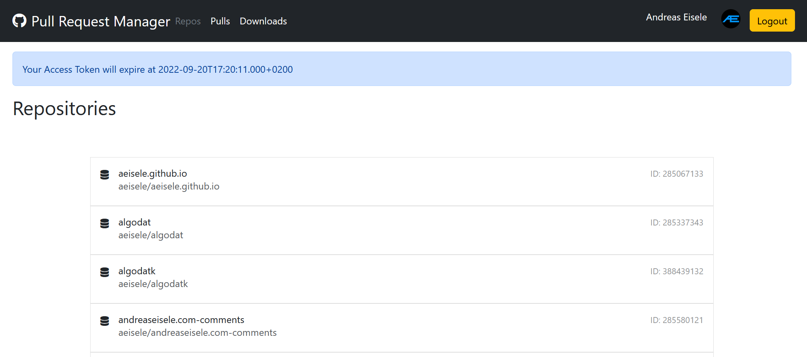
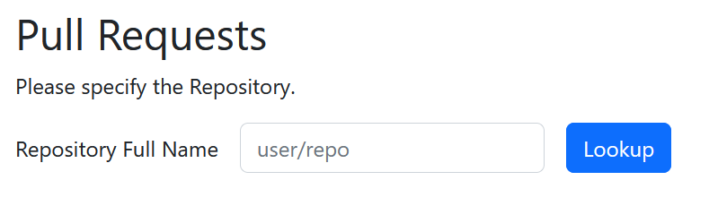
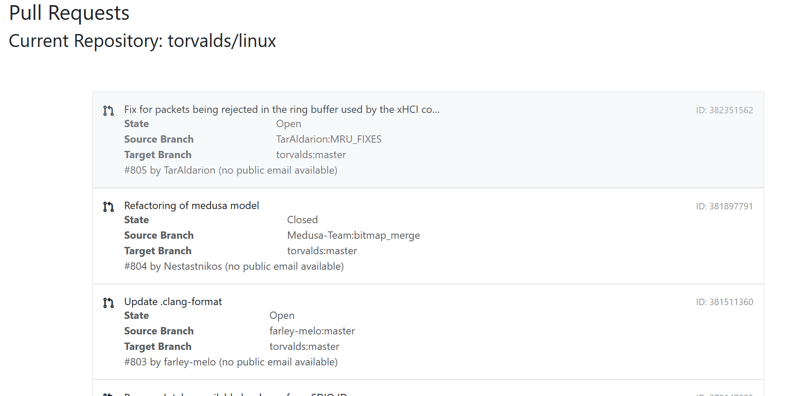
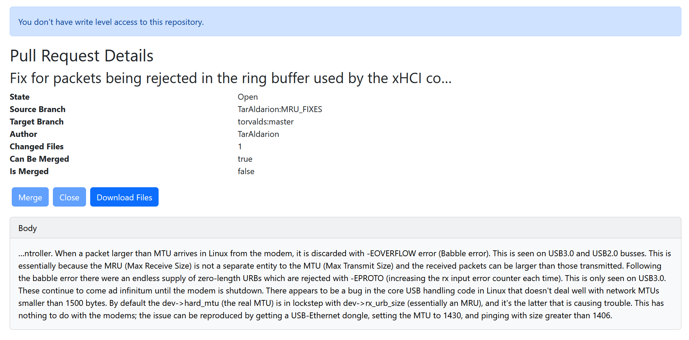
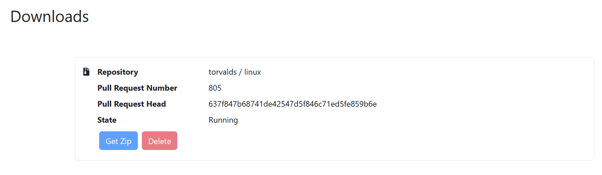

# Pull Man
a _Pull Request_ manager

## Requirements

 - Java 17
 - Maven 3
 - a GitHub access token with scopes "read:user" and "repo"

## Build
It's a standard maven build.
```
mvnw package
```

## Configuration

As this is _Spring Boot_ application the default configuration source hierarchy applies,
see [Documentation](https://docs.spring.io/spring-boot/docs/current/reference/html/features.html#features.external-config).

### Configuration Keys

| Key                                     | Description                                                     | Default Value          |
|-----------------------------------------|-----------------------------------------------------------------|------------------------|
| pullman.github.base-url                 | URL all API requests are based on                               | https://api.github.com |
| pullman.github.timeouts.connect-seconds | HTTP Connect Timeout in seconds                                 | 10                     |
| pullman.github.timeouts.write-seconds   | HTTP Write Timeout in seconds                                   | 10                     |
| pullman.github.timeouts.read-seconds    | HTTP Read Timeout in seconds                                    | 10                     |
| pullman.github.timeouts.call-seconds    | HTTP Call Timeout in seconds (spans the whole HTTP interaction) | 10                     |
| pullman.github.log-level                | Level of HTTP logging (one of none, basic, headers, body)       | none                   |
| pullman.github.merge-message            | message for the merge commit                                    | merged via Pullman     |
| pullman.github.download.location        | Local location for the download cache, must be a file or path   | file:./download_cache  |
| pullman.github.max-simultaneous         | number of concurrent downloads allowed                          | 10                     |

### Local Development

For local development it is advantageous to copy the file `application-local.properties.template` to a new
file `application-local.properties` and then run the application with the active spring profile `local`, e.g.
via `-Dspring.profiles.active=local`.

## Usage

The web app runs on `http://localhost:8080` by default.

Login with a GitHub username and the string value of a _personal access token_.

### Repos Page

This page serves as the home page after login and lists all repositories the user has direct access to.
This does not include all public GitHub repositories.

From here it is possible to navigate to the _Pulls_ page by clicking on a repository.



### Pulls Page

This page displays all pull requests in a given repository. The list is paginated with an item size of 30.

If no repository was chosen (via _Repos_ page) it is also possible to directly specify the repository via
text input. The input format is `owner/repository`.



Clicking on a pull request navigates to the 'Pull Request Details' page.



### Pull Request Details Page

This page lists further details about the chosen pull request.

If the given pull request is not closed it can be closed here.

If the given pull request is merge-able (as per the API), the user can request the merge here.
The merge will use a predefined commit message and the last known head revision of the underlying branch
to guard against merging unseen changes.

For any pull request it is possible to request the download of a zip archive containing the repository
state at the head revision of the pull request. This action navigates to the _Downloads_ page.



### Downloads Page

The _Downloads_ page displays all current and past downloads requested.

A download can be in the following states:
  - Running
  - Finished
  - Error

If a download is in the _Finished_ state it can be retrieved via the _Get Zip_ action.

If a download is not _Running_ it can be deleted. 

If a download gets requested (via the _Pull Request Details_ page) that already exists, it is not executed
again regardless of its state.



## Design Decisions

### DD.1 usage of _boring stack_

For the sake of simplicity and to not waste effort on unrelated problems, tech choices were made in favor of
familiar options unless otherwise necessary.

Amongst others this means:
  - Java instead of Kotlin
  - Maven instead of Gradle
  - Spring Boot instead of dagger2 / guice
  - Template based frontend instead of JS-based SPA + API
  - no reactive paradigms

### DD.2 _OkHttp_ as HTTP Client

Spring _RestTemplate_ is out of the picture as it is practically deprecated in favor of _WebClient_.
The latter won't be used as it only supports reactive interactions which are ruled out by _DD.1_.

The JVM 11 `java.net.http` client would be a pragmatic first choice but it doesn't provide all the necessary
features like preemptive authentication.

In a bigger project integration of _contract-based_ techniques like _Feign_ and/or _OpenAPI_ would be
chosen to enhance maintainability.

### DD.3 GitHub Rest API

Integration works against the GitHub Rest API to keep things simple.

One major disadvantage is that the Rest response bodies can get quite large and not all the info is needed.
Usage of GraphQL would rectify this problem.

### DD.4 URL construction

The GitHub API gives back complete URLs ones could use to navigate, e.g. from repo to pull requests.
Due to how the application is structured, usage of those URLs from a given DTO to later calls would
necessitate feeding back those URLs into request parameters. This could be problematic because we 
would still need to verify that the URLs are genuine and not malicious. So for the time being URLs
will be constructed as stated in GitHub's API documentation.

### DD.5 Business errors

It is a reoccurring question on how to handle errors in business logic. A number of different approaches
are thinkable:
 - Checked Exceptions
 - Result Types
 - Functional `Either` composition
 - Runtime Exceptions

Java comes with `Option` but not with monoic `Either`type and constructing one would be too complex for this
task.

At the same time custom generic result types sooner or later tend to mimic the usage pattern of
classic exceptions (causes, message concatenation, etc.) . Their only advantage is the cheaper runtime
cost due to not needing any stacktrace construction. Their disadvantage is the custom usage pattern where
one usually has to invoke check methods like `Result#isOk` before using the payload.

Hence the design decision to use runtime exceptions here even when their usage is sometimes frowned upon.
To alleviate the cost of stack trace construction we will use so called _lite weight exceptions_ that don't
carry stack traces. This is in no way a perfect solution and not a proposal in general, but it fits with
the task.

## Points of Interest

### API Integration

The main interaction with the GitHub rest API happens via the dedicated class `GitHubClient`. This class
and the surrounding DTOs / value types are responsible for that.

### Download Cache

The cache for the downloaded zip files is made out of two parts.

The in memory portion can be found in the class `DownloadService`. Downloads and their current states
are kept in a `ConcurrentHashMap`. The interaction methods are supposed to make sure all state transitions
happen in a valid order.

The disk portion of the cache is facilitated via the class `FileStore`. This part is responsible with storing
the zip files in the appropriate file structure and to retrieve them later on.

On application startup both parts work in tandem to re-establish past successful downloads.

## Missing Stuff

### I18N

Strings are hardcoded to US english for now. Both Spring and Thymeleaf would support I18N via resource
bundles though.

### Proper Client Notifications

Currently there are rudimentary _Server Side Events_ to basically trigger a reload of the downloads page
on status changes. Due to all kinds of edge cases regarding browser compatibility / settings this is not
a super solid solution and more like an 'extra'. 

### Handling of user permissions

The OAuth scopes of a GitHub access token are quite broad. Even though we take the scopes and turn them
into _Spring Security's authorities_ this is not enough to make fine granular decisions. At the moment
repository permissions are checked via the collaborators permission endpoint.

### Proper Caching

The GitHub API supports response caching via ETags. OkHttp already comes with an optional cache that could
make use of that.

Also the download cache could be rewritten to make use of _Spring's_ cache abstraction, then it would be
possible to switch out the cache in favor of something like _EhCache_ if the need should arise.

### Force logout for expired users

We already know the token lifetime, if we detect that it is in the past we could force a logout. Best way
to do this would probably be a servlet request filter or _Spring_ interceptor, to apply it globally.